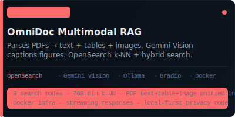
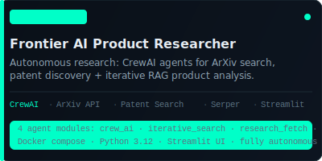
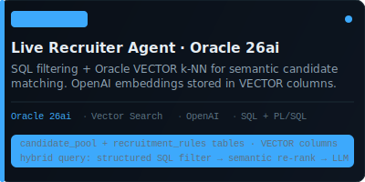
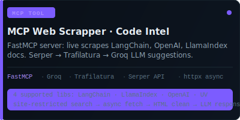
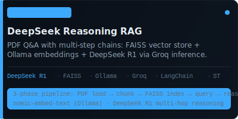
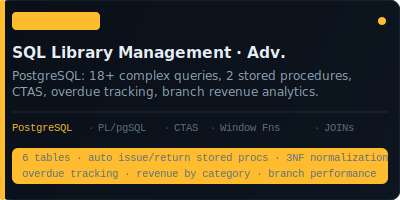
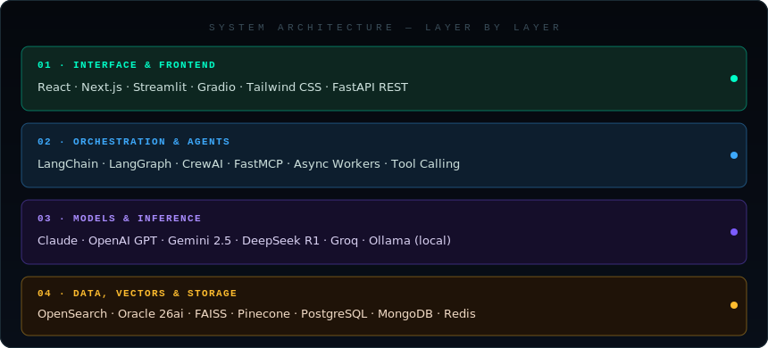
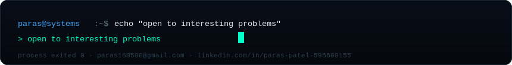

<div align="center">

</div>

<br/>

<div align="center">

<a href="mailto:paras160500@gmail.com">

</a>

<a href="https://www.linkedin.com/in/paras-patel-595600155">

</a>

<a href="https://github.com/paras160500">

</a>

</div>

<br/>


<br/>

## `$ ls -la projects/ --sort=complexity`

<br/>

<table width="100%">
<tr>
<td width="50%" valign="top">
<a href="https://github.com/paras160500/OmniDoc-RAG-Advanced-Multimodal-Retrieval-Augmented-Generation">

</a>
</td>
<td width="50%" valign="top">
<a href="https://github.com/paras160500/Frontier-AI-Product-Researcher-MAS-RAG">

</a>
</td>
</tr>
<tr>
<td width="50%" valign="top">
<a href="https://github.com/paras160500/Live-Recruiter-Agent---Oracle-Cloud-MAS-RAG">

</a>
</td>
<td width="50%" valign="top">
<a href="https://github.com/paras160500/MCP-Web-Scrapper-for-code-suggestions">

</a>
</td>
</tr>
<tr>
<td width="50%" valign="top">
<a href="https://github.com/paras160500/DeepSeek_Reasoning_RAG">

</a>
</td>
<td width="50%" valign="top">
<a href="https://github.com/paras160500/SQL_Library_Management_Advance_Project">

</a>
</td>
</tr>
</table>

<br/>

> [!TIP]
> **mindspace_AgenticAI**
>
> LangChain tool-calling agent with multi-LLM routing (OpenAI, Groq, Ollama), powered by an async FastAPI backend and a Streamlit frontend.

<br/>

## `$ cat stack.architecture`

<div align="center">

</div>

<br/>

## `$ git log --oneline --stats`

<div align="center">


</div>

<br/>

## `$ tail -f current.log`

```
[active]  rebuilding retrieval around hybrid search + reranking
[active]  tuning multi-agent handoff to cut latency, not just API cost  
[active]  exploring fine-tuning vs context-engineering tradeoffs in prod
[active]  adding streaming + async to every new system from day one
```

<br/>

<div align="center">

<br/><br/>

</div>
